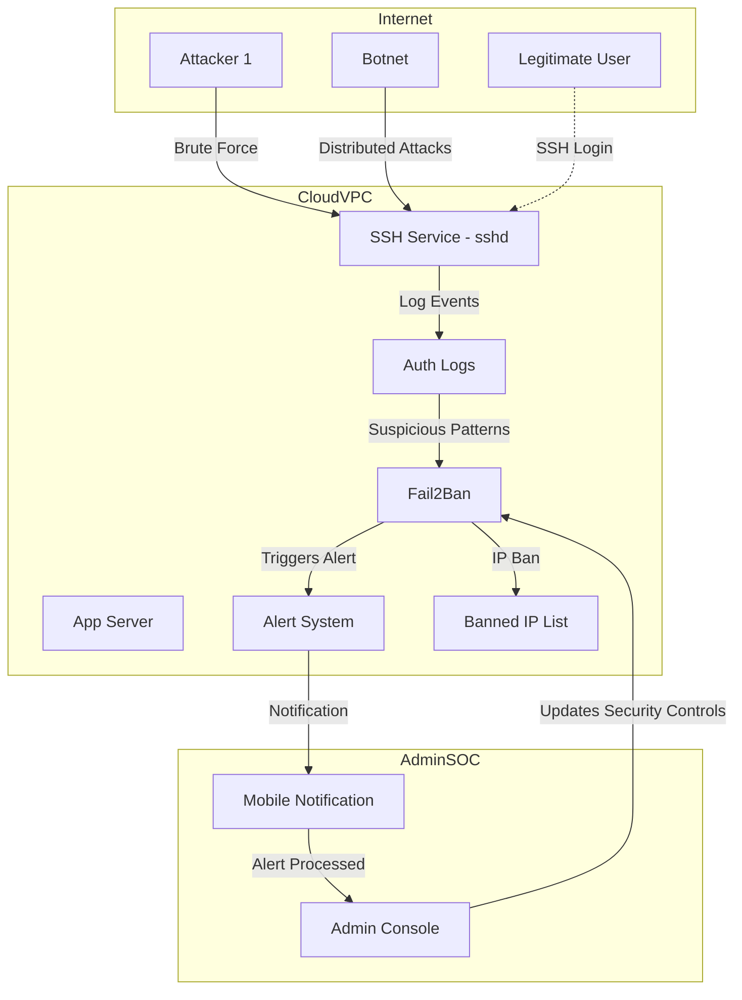

# Home Security Cloud Monitoring Project

This repository demonstrates a cloud-based security monitoring lab using an Ubuntu VM on Google Cloud Platform. It includes host hardening, Fail2Ban for brute-force protection, Suricata IDS for network detection, example logging (Nginx), and an automated alerting example.

---

## Table of Contents
- Overview
- Diagram
- Quickstart
- Step-by-step (with screenshots)
  - Create VM
  - Connect and update
  - Hardening: users & firewall
  - Install core tools: Fail2Ban, Nginx, Suricata
  - Email alert test
  - Automation (cron / systemd)
- Example hardened alert script (reference)
- Testing & validation
- Troubleshooting

---

## Overview
Goal: deploy a single-cloud VM lab demonstrating basic host/network monitoring and alerting:
- Harden the host (non-root admin, UFW, SSH config)
- Protect SSH with Fail2Ban
- Monitor network traffic with Suricata
- Generate logs with Nginx (optional)
- Send alerts via mailutils
- Automate checks with cron or systemd timer

---

## Diagram


---

## Quickstart (TL;DR)
1. Create an Ubuntu 22.04 VM in Google Cloud (e2-medium recommended).
2. SSH in (use key-based auth).
3. Update packages, create non-root admin, enable UFW.
4. Install Fail2Ban, Nginx, Suricata, mailutils, cron.
5. Place the alert script at `/usr/local/bin/security-alert.sh`, make it executable, and schedule via systemd timer or cron.

---

## Step-by-step 

### 1 — Open Google Cloud Console
Start in the Google Cloud dashboard to create and manage your VM.

*Figure: GCP console project dashboard*

---

### 2 — Create the Virtual Machine (Ubuntu 22.04)
Create an instance (e2-medium recommended). Ensure firewall rules for required services are set.

*Figure: VM instance creation page*

---

### 3 — Verify VM Is Running (External IP assigned)
Confirm the VM is running and note its external IP for SSH.

*Figure: VM details page*

---

### 4 — Connect to VM via SSH
Open an SSH session (use key-based authentication).

*Figure: SSH session terminal*

---

## 🔐 Initial Security Hardening

### 5 — Update System Packages
Keep the system current:
```bash
sudo apt update && sudo apt upgrade -y
```

*Figure: System update in terminal*

---

### 6 — Create a New Admin User
Create a non-root admin account and add to sudo group:
```bash
sudo adduser james
sudo usermod -aG sudo james
```

*Figure: Add user screenshot*

Tip: Upload the admin user's public key to `~james/.ssh/authorized_keys` and disable password auth in `/etc/ssh/sshd_config`:
- PermitRootLogin no
- PasswordAuthentication no
- AllowUsers james

Restart SSH: `sudo systemctl restart sshd`

---

### 7 — Enable and Configure Firewall (UFW)
Allow SSH and any needed service ports, then enable UFW:
```bash
sudo apt install ufw -y
sudo ufw allow OpenSSH
sudo ufw allow 80/tcp   # only if serving HTTP
sudo ufw enable
sudo ufw status verbose
```

*Figure: UFW enable confirmation*

---

## 🛡️ Install Core Security Tools

### 8 — Install Fail2Ban for SSH Protection
```bash
sudo apt install fail2ban -y
```

*Figure: Installing Fail2Ban*

Configure a jail (e.g. `/etc/fail2ban/jail.d/ssh.conf`) and restart the service:
```ini
[sshd]
enabled = true
port = ssh
filter = sshd
logpath = /var/log/auth.log
maxretry = 5
bantime = 3600
```
Restart: `sudo systemctl restart fail2ban`

### 9 — Verify Fail2Ban Is Running
```bash
sudo systemctl status fail2ban
```

*Figure: Fail2Ban status*

---

### 10 — Install Nginx (for log generation / testing)
```bash
sudo apt install nginx -y
```

*Figure: Nginx install*

Nginx access/error logs provide traffic events useful for IDS/forensics.

---

### 11 — Install Suricata IDS
```bash
sudo apt install suricata -y
```

*Figure: Suricata install*

Tune `/etc/suricata/suricata.yaml`, enable EVE JSON output for SIEM forwarding, and set resource limits appropriate for your VM size.

### 12 — Confirm Suricata Is Active
```bash
sudo systemctl status suricata
```

*Figure: Suricata status*

---

## ✉️ Email Alert System Setup

### 13 — Install Mailutils (MTA)
```bash
sudo apt install mailutils -y
```

*Figure: Mailutils installation*

Note: For reliable delivery, configure a secure SMTP relay or cloud email provider rather than sending directly from the VM.

### 14 — Test Email Alert Function
Use a quick test to verify outbound mail:
```bash
echo "Security Alert Test" | mail -s "Alert Test" your-email@example.com
```

*Figure: Email test command*

---

## ⚙️ Automation Setup

### 15 — Install Cron Service
```bash
sudo apt install cron -y
sudo systemctl enable --now cron
sudo systemctl status cron
```

*Figure: Cron status*

### 16 — Create Security Alert Script
Place a script at `/usr/local/bin/security-alert.sh` that checks `/var/log/auth.log` for failed SSH attempts and sends alerts. (See the "Example hardened alert script" section below.)

Original screenshot (example edit session):

*Figure: Editing script with nano*

### 17 — Make Script Executable
```bash
sudo chmod +x /usr/local/bin/security-alert.sh
```

### 18 — Add Cron Job (or systemd timer)
Cron example (run every 5 minutes):
```bash
sudo crontab -e
# add:
*/5 * * * * /usr/local/bin/security-alert.sh
```

*Figure: Cron entry in editor*


---

## Example hardened alert script
Place and configure the following as `/usr/local/bin/security-alert.sh` (make executable). This is a hardened example that avoids broken quotes, uses a date fragment matching syslog, and thresholding to avoid email storms. Be sure to set `ALERT_EMAIL` before using.

```bash
#!/usr/bin/env bash
set -euo pipefail
LOGFILE="${LOGFILE:-/var/log/auth.log}"
KEYWORD="${KEYWORD:-Failed password}"
ALERT_EMAIL="${ALERT_EMAIL:-your-email@example.com}"
THRESHOLD="${THRESHOLD:-3}"
TAIL_LINES="${TAIL_LINES:-200}"
HOSTNAME="$(hostname -f)"
DATE_FRAGMENT="$(date '+%b %e')"
count=$(grep -F "$KEYWORD" "$LOGFILE" 2>/dev/null || true | grep -F "$DATE_FRAGMENT" || true | wc -l || true)
count=${count:-0}
if [ "$count" -ge "$THRESHOLD" ] && [ "$count" -gt 0 ]; then
  body="$(printf 'Host: %s\nDetected: %s occurrences of \"%s\" in %s\n\nLast matching lines:\n' "$HOSTNAME" "$count" "$KEYWORD" "$LOGFILE")"
  body+=$(grep -F "$KEYWORD" "$LOGFILE" 2>/dev/null | grep -F "$DATE_FRAGMENT" | tail -n "$TAIL_LINES" || true)
  printf '%s\n' "$body" | mail -s "SSH Alert on ${HOSTNAME}: ${count} ${KEYWORD}" "$ALERT_EMAIL"
  logger -t security-alert "Sent alert: ${count} ${KEYWORD} occurrences; email to ${ALERT_EMAIL}"
fi
```

---

## Testing & validation
- Fail2Ban:
  - `sudo fail2ban-client status sshd`
  - Simulate failed logins (from a test host) and confirm bans.
- Suricata:
  - Use test PCAPs or scanner rules; check `/var/log/suricata/eve.json` (if enabled).
- Email:
  - Check `/var/log/mail.log` and that your SMTP relay/port is reachable.
### Example Brute Force Logging Notification


> _Fail2Ban blocks brute force attempts and notifies administrators when an attack is detected._

---

## Troubleshooting
- No mail delivery:
  - Check `journalctl -u postfix` (if using postfix) or `/var/log/mail.log`.
  - Verify outbound port access or configure authenticated relay.
- Cron job not running:
  - Check `/var/log/syslog` for cron entries, or prefer systemd timers.
- Suricata high CPU:
  - Tune detection rules and thread settings in `/etc/suricata/suricata.yaml`.

---
